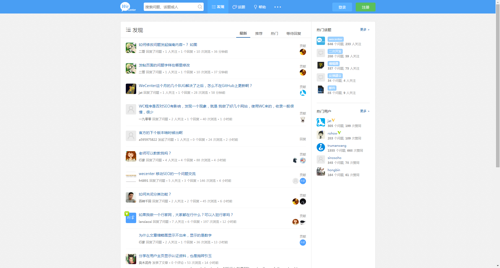

# docker-wecenter
docker化WeCenter

## WeCenter

WeCenter 是一款知识型的社交化开源社区程序，专注于企业和行业社区内容的整理、归类、检索和再发行。

#### 为什么选择 WeCenter 程序？

###### 管理中心，一手掌控

管理中心为你建立起快速通路，所有功能开关，只需轻点一下，即可轻松完成配置，如此众多的操控，任你一挥而就

###### 开放源码，便捷开发

WeCenter 含有多项创新功能，遵循 MVC 架构，充分利用当下最新技术，对于开发者来说都会大有帮助，二次开发，更强定制，更易上手

###### 个性路由，个性定制

WeCenter 让你用你喜欢的方式，更灵活地定制 URL 路由，URL 地址不再是千篇一律的样式，在 SEO 优化上祝你一臂之力

###### 设计之妙，上手即知

我们创造的每一件产品，从来都不仅仅追求设计的美观。我们在考虑设计的同时，更希望用户更能容易定制模板，最终我们选择了 Bootstrap，定制模板时你会发现一切都是那么的方便，简易

## Docker WeCenter

我们采用最新版本的WeCenter [3.1.3](http://www.wecenter.com/download/WeCenter_3-1-3.zip)。可能你构建当前Dockerfile项目时，该版本以及过时了。当然，你可以去WeCenter去查看最新的版本，替换当前版本。

#### 镜像特点

- 2015/8/1 继承基础镜像docker-lamp

#### 使用方法

- 获取代码并构建

        git clone https://github.com/Dockerlover/docker-kityminder.git
        cd docker-kityminder
        docker build -t docker-wecenter .

- 运行容器

        docker run -it -d --name wecenter -p 8005:80 docker-wecenter

- 访问kity minder

        http://localhost:8005

    你将会看到如下的内容：
    
    
